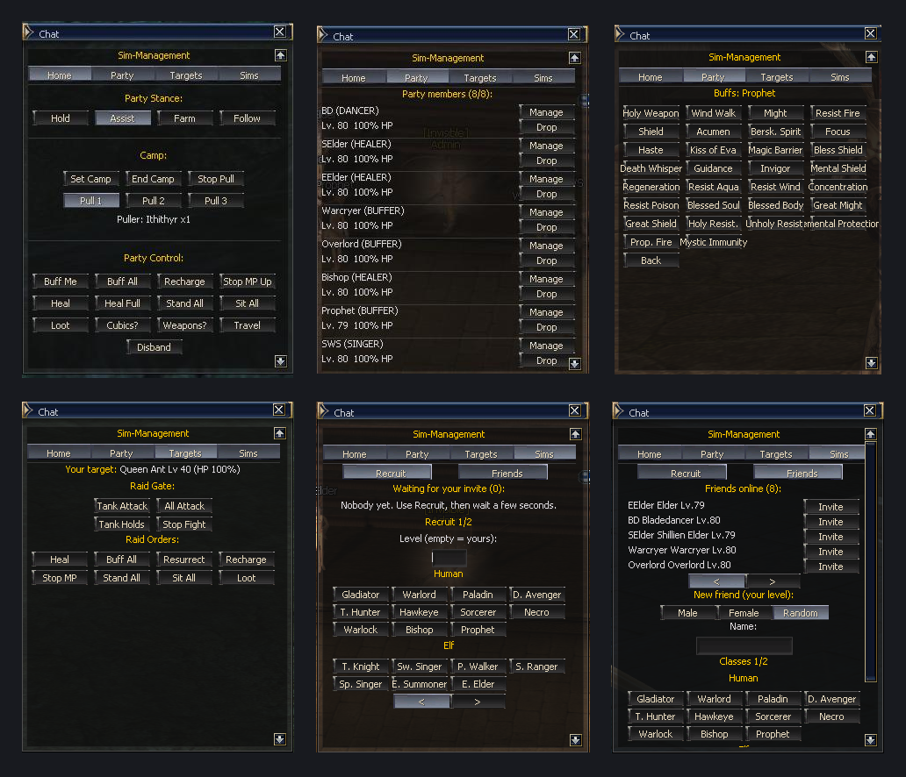

# PHANTOM Management by nekelone_

> **Version** 1.0.0 &nbsp;|&nbsp; **Author** nekelone_ &nbsp;|&nbsp; **Module id** `phantom-management`

A chat-window control panel for managing your party of Phantoms and Friends on **L2 Living Worlds**.
Recruit Phantoms, create persistent Friends, and command the whole party (stance, camp, pulling, buffs, healing,
loot, travel) or each Phantom individually, all through buttons. Class-specific actions such as buffs, dances, songs,
cubics and weapon switching appear automatically for the classes that have them. The window refreshes itself while
it is open.

Type **`.phantom`** in the chat to open the menu.

## Features

* **One panel, four tabs:** Home, Party, Targets and Phantoms.
* **Party-wide stance control:** Hold, Assist, Farm and Follow.
* **Camp and pull system:** set a camp, choose a puller and pull 1, 2 or 3 mobs per batch.
* **Party orders:** buffs, heals, MP recharge, loot, sit/stand, travel and disband in a click.
* **Travel menu:** move the whole party to 15 towns and villages, from Talking Island to Goddard.
* **Per-Phantom Manage menu:** every Phantom shows only the actions its class can use.
* **Raid control:** quick commands for fighting raid bosses (Tank Attack, All Attack, Tank Holds, Stop Fight).
* **Recruit any of the 31 second classes** at the level you choose, or at your own level.
* **Persistent Friends:** create Friends with a custom gender, name and class; they are saved on the server and can
  be invited again at any time.

## Installation

1. Copy this folder into your server's `game/modules/` directory so you end up with
   `game/modules/phantom-management/`.
2. Start the launcher. **PHANTOM Management** appears in the **Installed Modules** panel.
3. Make sure the module is enabled, then restart the server. The module takes effect on the next start.

No server rebuild is required.

### Uninstall

Disable the module, then delete its folder from `game/modules/`. Friends you created are saved as ordinary
characters on the server, so they are not removed by deleting the module.

## Usage

Open the panel with `.phantom`. Everything is controlled with buttons, grouped in four tabs (Home, Party, Targets,
Phantoms). A full walkthrough is in the wiki PDFs under [`assets/`](assets) (English and Spanish).

## Compatibility

Built for **L2 Living Worlds**. The module drives the server's existing phantom party system
(`PhantomPartyManager`, `PhantomBuddyManager`, `PhantomManager`, `PhantomBuffs`), so it needs a build that includes
them. No core file is modified.

## Configuration

Set in `config/module.ini`:

| Setting | Default | Meaning |
|---|---|---|
| `Enabled` | `True` | Master switch. With `False` the module registers nothing and the server behaves as stock. |
| `MaxFriendsPerPlayer` | `10` | Maximum Friends one player can own in total. `0` = unlimited. |
| `FriendCreateCooldownSeconds` | `120` | Wait time between two Friend creations. |
| `ConfirmFriendCreation` | `True` | Creating a Friend needs a second click on the same class. |
| `AutoRefresh` | `True` | Live refresh of Party/Targets/Phantoms pages. `False` = pages update only on click. |
| `AutoRefreshSeconds` | `0` | `0` = refresh always (stops only when another window replaces the panel). 5-600 = stop this many seconds after your last click. |
| `ExtraForbiddenNames` | short built-in list | Forbidden name fragments (comma separated), added to the server's `ForbiddenNames` list. |

## License

Released under the GNU General Public License v3.0, the same license as this repository.
